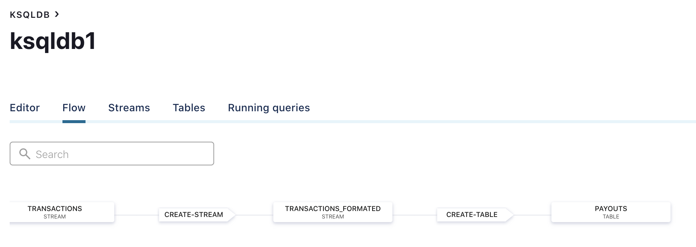

In this step, we're going to manipulate some Kafka Streams using KSQL. We're going to create 2 `Streams` and 1 `Table`:
* `transactions`
* `transactions_formatted`
* `payouts`

Each `Stream` serves its own purpose of aggregating transactions by `merchant_id` and `month`.

To understand a little more about the differences between `Stream` and `Table`, you can read a brief introduction to [Streams and Tables in Kafka](https://www.confluent.io/blog/kafka-streams-tables-part-1-event-streaming/).

You can accomplish this tutorial either through **Control Center** or **CLI**:

## CLI
* Connect to your ksqlDB instance:
```
docker-compose exec ksql-cli ksql http://ksql-server:8088
```
* When you enter in KSQL console, run the following commands:
```
CREATE STREAM transactions WITH (KAFKA_TOPIC = 'transactions', VALUE_FORMAT='AVRO');
CREATE STREAM transactions_formated WITH (VALUE_FORMAT='AVRO') AS SELECT TIMESTAMPTOSTRING(timestamp, 'yyyy-MM') AS month, merchant_id, amount FROM transactions;
CREATE TABLE payouts WITH (VALUE_FORMAT='AVRO') AS SELECT month, merchant_id, SUM(amount) AS AMOUNT FROM transactions_formated GROUP BY month,merchant_id;
```
You can validate if it worked by describing the `payouts` table:
```
DESCRIBE EXTENDED payouts;
```

## Control Center
[](https://youtu.be/X6Xy8Vq53lw)

You can validate if everything worked properly in the `Flow` tab on the same page:
