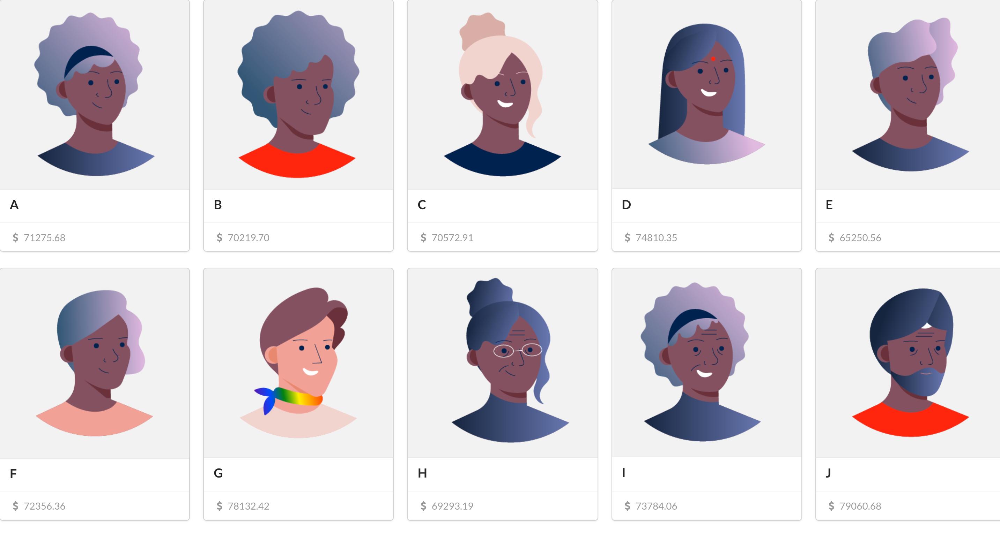

## Requirements
* Deno >= 1.0.0 ([install instructions](https://deno.land/#installation))
* Ruby ([install instructions](https://www.ruby-lang.org/en/))
* Yarn ([install instructions](https://yarnpkg.com/getting-started/install))

## Usage
You'll need 2 terminals in order to make Publisher and Consumer work together.
On your first terminal:
```
cd clients/payout_generator
ruby publisher.rb
```
On your second terminal:
```
cd clients/payout_dashboard
yarn install
yarn start
```
It will run both backend and frontend at once

Enjoy seeing the amount for each merchant to raise
